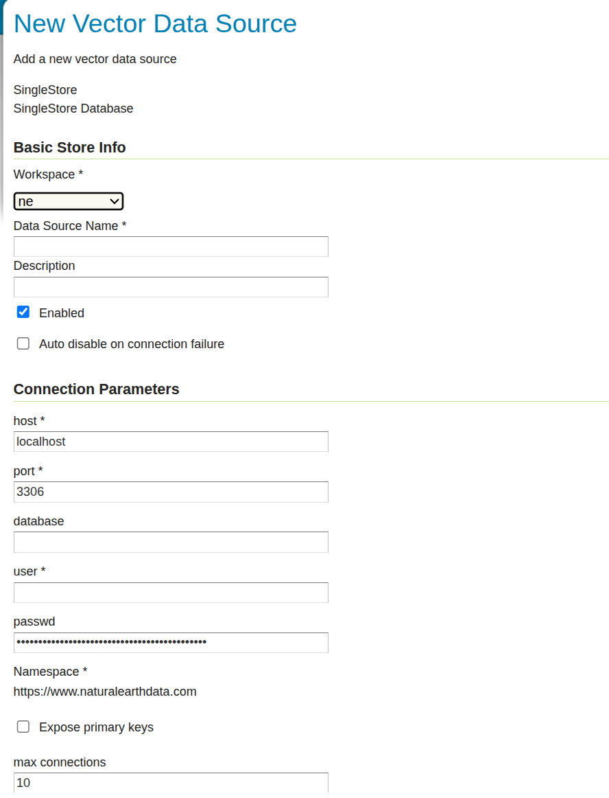
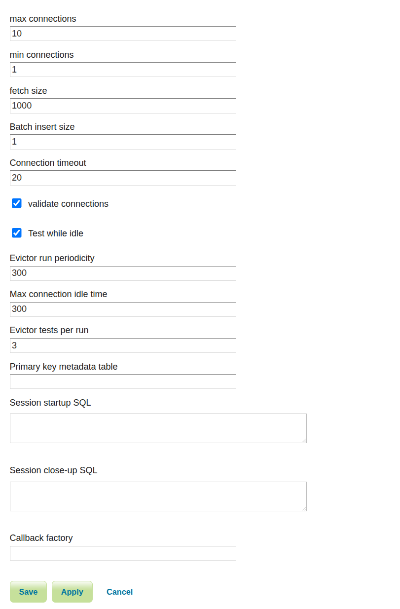

.. _data_singlestore:

SingleStore
===========

.. note:: GeoServer does not come built-in with support for SingleStore; it must be installed through an extension. Proceed to :ref:`singlestore_install` for installation details.

.. warning:: Currently the SingleStore extension is unmaintained and carries unsupported status. While still usable, do not expect the same reliability as with other extensions.

`SingleStore <https://www.singlestore.com>`_ is an open source relational database with some limited spatial functionality.

.. _singlestore_install:

Installing the SingleStore extension
------------------------------------

#. Visit the :website:`website download <download>` page, locate your release, and download: :download_extension:`singlestore`
   
   .. warning:: Ensure to match plugin (example |release| above) version to the version of the GeoServer instance.

#. Extract the contents of the archive into the :file:`WEB-INF/lib` directory of the GeoServer installation.

Adding a SingleStore database
-----------------------------

Once the extension is properly installed ``SingleStore`` will show up as an option when creating a new data store.

.. figure:: images/singlestorecreate.png
   :align: center

   *SingleStore in the list of data sources*

Configuring a SingleStore data store
------------------------------------

   *Configuring a SingleStore data store*

   *Configuring a SingleStore data store*

.. list-table::
   :widths: 20 80

   * - ``host``
     - The SingleStore server host name or ip address.
   * - ``port``
     - The port on which the SingleStore server is accepting connections.
   * - ``database``
     - The name of the database to connect to. Can also contain a suffix with a connection URL query, such as `mydbname?useSSL=false`
   * - ``user``
     - The name of the user to connect to the SingleStore database as.
   * - ``password``     
     - The password to use when connecting to the database. Left blank for no
       password.
   * - ``max connections`` ``min connections`` ``validate connections``
     - Connection pool configuration parameters. See the 
       :ref:`connection_pooling` section for details.

